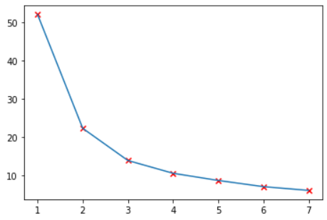
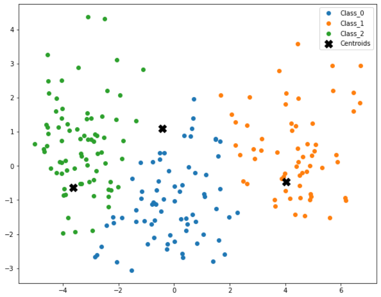

# K Nearest Neighbor

In pattern recognition, the k-nearest neighbors algorithm (k-NN) is a non-parametric method used for classification and regression. The kNN algorithm assumes that similar data points exust in close proximity. This means that their exist clusters of data in the hyper space they are plotted in. This effect can also be seen in daily life. In our cities, we see that similar shops are often present very close to each other, like the fast food joints.

The idea of the kNN algorithm is to define cluster's depending on the proximity of the data points to a specific point called as centroid or cluster centroid as shown in the below image,

    

## Steps
Their are 3 steps in the kNN algorithm, These are :-

1. Initiaization
In this step, first we decide how many centroids aka classes are their in our dataset, This can be done heuritically or by Exploratory data analysis. In our case, we have found how many centroids are their by plotting the data points.

Next, we have to initialize the centroid points. There are 2 ways to do so,

- Random initialization : We can randomly choose any point using a random generator or by hand in our data point range.
- Random Data Point Selection : We can use an existing data point in our dataset as initial centroid point.

2. Centroid Assignment
The next step is to assign data points to one of the centroids we have initialized, this is done as follows :

- calculate distance of each data point from each centroid using euclidean distance formula
- Select the centroid with the lowest distance from the data point

3. Centroid Calculation
After we have assigned each data point to a centroid, now we are going to calculate new centroid based on the assigned data points. This is done as:
- find the mean of data points assigned to a centroid and set that mean as the new centroid

## Elbow Method
A fundamental step for any unsupervised algorithm is to determine the optimal number of clusters into which the data may be clustered. The Elbow Method is one of the most popular methods to determine this optimal value of k. In this we choose a range of values for k and for each value we calculate the *Distortion*. 

**Distortion**: It is calculated as the average of the squared distances from the cluster centers of the respective clusters. Typically, the Euclidean distance metric is used.
The optimal value of `k` lies at the elbow of the grapgh as shown below.

## Results
Running kNN on a bigger dataset with more features requires us to use `PCA` to lower the number of features so that we can plot the clusters. The results look like the plot below.

# References
- kNN: https://en.wikipedia.org/wiki/K-nearest_neighbors_algorithm